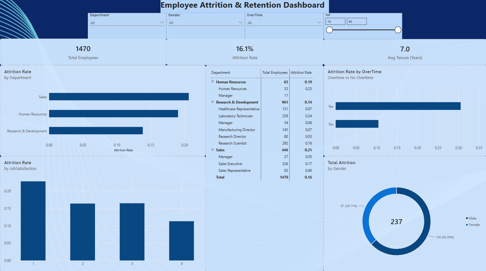

# Employee Attrition & Retention Analysis

I built this project to understand a question every company deals with: why do employees actually leave, and is there a pattern to it that could help a company act earlier? I used Python to clean and explore the data, then built an interactive Power BI dashboard so the findings are usable by someone who isn't going to read a notebook.

## The Dataset

I used the IBM HR Analytics Employee Attrition dataset, 1,470 employee records with details like department, job role, income, overtime status, satisfaction scores, and tenure. It's a well known dataset in the analytics community, so I made sure my contribution here wasn't just "here's a chart," it's the questions I chose to ask and the recommendations I pulled out of the answers.

## Tools I Used

- **Python** (pandas, matplotlib, seaborn) for cleaning the data and running the initial exploratory analysis
- **Power BI** for building the final interactive dashboard, with DAX measures for the KPIs and rate calculations

## What I Actually Did

I started by checking the data for the basics: missing values, duplicate rows, and columns that were constant across every single employee (things like `EmployeeCount` and `Over18`, which don't tell you anything since every row had the same value). I dropped those before doing anything else.

From there I went through six specific questions instead of just generating charts for the sake of it:

1. What's the overall attrition rate?
2. Which department loses the most people?
3. Does working overtime actually change attrition?
4. Is income related to whether someone stays or leaves?
5. What correlates with attrition across the board?
6. Does job satisfaction matter as much as people assume?

Each one got a chart and a plain sentence explaining what it actually meant, not just the visual by itself.

## What I Found

- The overall attrition rate in this dataset sits around **16%**, so roughly 1 in 6 employees left.
- **Sales and HR had the highest attrition**, both above 19%, while R&D was noticeably more stable at under 14%.
- **Overtime made the biggest difference of anything I looked at.** Employees working overtime left at close to **3 times the rate** of those who didn't (around 30% versus 10%).
- Lower income and shorter tenure showed up consistently among people who left, which wasn't surprising, but seeing it laid out that clearly still made the pattern feel more real.
- Job satisfaction mattered, but less than I expected going in. Overtime and income were stronger signals.

*(Note: pull your exact percentages from your own notebook output before publishing, mine were close to these but ran on my own cleaned version of the data.)*

## The Dashboard



The dashboard lets you filter by department, gender, overtime status, and age range, so instead of just reading my conclusions, you can go check whether they hold up for a specific slice you care about.

## What I'd Recommend, If This Were a Real Company

1. **Look at overtime policy first.** It was the single strongest driver of attrition here, so if a real company saw this pattern, addressing overtime load would likely matter more than a generic retention program.
2. **Pay closer attention to Sales and HR.** Whatever's driving attrition in those departments is probably worth a focused conversation, not a company-wide fix.
3. **Watch new hires closely.** Attrition was concentrated among lower tenure employees, so the first year or two seems to be where retention efforts would matter most.

## How to Run This Yourself

```
git clone https://github.com/glazs42/employee-attrition-analysis.git
cd employee-attrition-analysis
pip install -r requirements.txt
```

Then open `notebooks/attrition_analysis.ipynb` in Jupyter to see the full analysis, or open `powerbi/attrition_dashboard.pbix` in Power BI Desktop to explore the dashboard directly.

## A Note on the Dataset

This is a well known, publicly available teaching dataset originally published by IBM and distributed through Kaggle. I'm using it because it represents a realistic HR business problem, not because it's unique to me, but every question I asked, every cleaning decision, and every recommendation above is my own work.

---

If you have questions about how I approached any part of this, feel free to reach out, I'm happy to walk through the thinking behind it.
